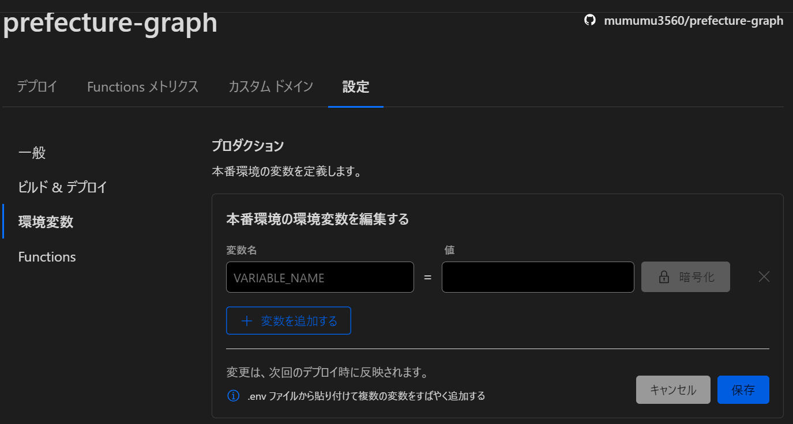

# 進捗や現在の問題などを書く

### 12/02 
#### Cloudflare Pageでのbuildエラーについて
❌ Invalid environment variables: {     
08:19:33.285	▲  PREFECTURES_API_URL: [ 'Invalid url' ],      
08:19:33.285	▲  POPULATION_API_URL: [ 'Invalid url' ]        
08:19:33.285	▲  }        
というエラーが出た(API_KEYは問題なさそう)       
.env.localでは
PREFECTURES_API_URL=https://opendata.resas-portal.go.jp/api/v1/prefectures      
POPULATION_API_URL=https://opendata.resas-portal.go.jp/api/v1/population/composition/perYear?   prefCode=

のように定義されているためこれの何がおかしいかを調べる。

そもそもT3の方ではnext.jsのバージョンがFor Next.js >= 13.4.4なら        
experimental__Envでいいはずなのにrequiredされたのがよくわからない

runtimeEnv:{
        API_KEY: process.env.API_KEY,
        PREFECTURES_API_URL: process.env.PREFECTURES_API_URL,
        POPULATION_API_URL: process.env.POPULATION_API_URL,
   }
としても駄目だった。        
というか.env.localはgithubにないのでCloudflareが認識できないのは当然だ。
本番環境ではどうすればいいんだ？        
↓       
Cloudflare Pagesの設定で以下の部分で環境変数を追加するとprocess.env.[variables]でアクセス可能       

#### checkBoxの当たり判定
これを参考にしてみる
https://quartet-communications.com/info/topics/7165

#### testの書き方
CheckBoxを作ったのでちゃんと動くかのテストを書く。
fireEvent→userEventにしたほうがいい？まだテストについて良くわかっていない部分があるので
勉強の必要がある。余裕のある時に。

### 12/04

#### CheckBoxのリストの作成。
チェックボックスは地域ごとに分けて選択できるようにしたい。  
RESAS APIを見ると、地域でまとまって都道府県が並んでいるので取得した都道府県が何番目かで地域分けができる。地域の分け方は         
1北海道+東北、2関東、3中部、4近畿、5中国、6四国、7九州          
にしてみる。

参考            
https://liginc.co.jp/designer/archives/81               
https://kinocolog.com/pref_select/ 

EX                           
個人的には日本地図をタップすると色が変わって選択されたことがわかるようなものとかが欲しいなと思った。            
色々実験できるし地域による特徴も分かりやすそうなのでUXがよさそう。   
都道府県 レスポンシブデザインでググると以下のサイトを見つけた           
http://takuri.realwork.jp/freematerials/2607            
これは良さそうだ使ってみよう。     

ChatGPTを使ってCheckBoxListを作成したが問題がある。        
まずスマホだと横にリストが並ばないし、PCでも画面を大きくとるのでグラフが下の方になってしまい
スクロールが面倒
     
ドロップダウンリストにチェックボックスを入れるようにしようか？

### 12/05 

#### Github ActionsでのPrettierによるformatとESLintによる解析
最初にやっておくべきだったがこれはGithub Actionsでやるべきだった
github action format nextで検索
https://zenn.dev/bloomer/articles/c48eff0e4b2b10
https://deku.posstree.com/react/github-actions/prettier-eslint/
t3のenv周りでエラーが出るがどうすればいい？よくわからない。沼りそうなので余裕のある時に

#### HighChartsでグラフを表示する
https://zenn.dev/itch/articles/9aa61eb25d43a6
https://zenn.dev/shimapon3/articles/13e3d4b147742c
参考になる日本語のサイトはたくさんあるのでそれを参考にすればいいが、そういった物がないこともある。
(自分の場合はOneSignalとかCloudflareとかGODOTとかでそうなった。)                
ので経緯を書いてみる
https://zenn.dev/mumumu3/scraps/e10841e0767b8d
