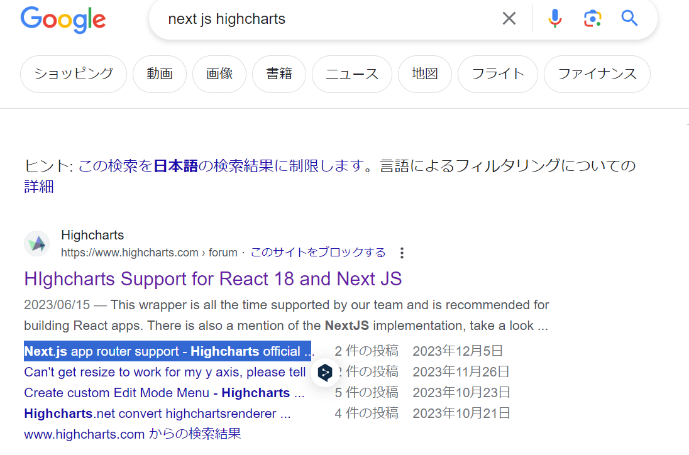
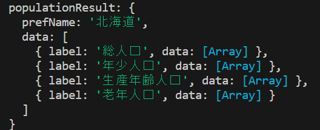
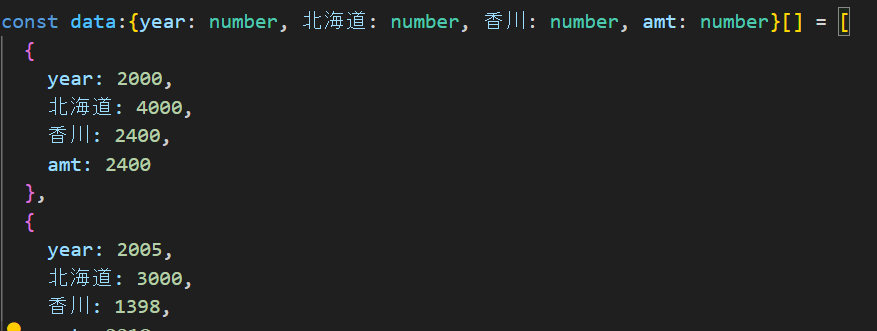

# 進捗や現在の問題などを書くメモ帳のようなもの？実際だとslackとかに書く？かも

### 12/02 
#### Cloudflare Pageでのbuildエラーについて OK
❌ Invalid environment variables: {     
08:19:33.285	▲  PREFECTURES_API_URL: [ 'Invalid url' ],      
08:19:33.285	▲  POPULATION_API_URL: [ 'Invalid url' ]        
08:19:33.285	▲  }        
というエラーが出た(API_KEYは問題なさそう)       
.env.localでは
PREFECTURES_API_URL=https://opendata.resas-portal.go.jp/api/v1/prefectures      
POPULATION_API_URL=https://opendata.resas-portal.go.jp/api/v1/population/composition/perYear?   prefCode=

のように定義されているためこれの何がおかしいかを調べる。

そもそもT3の方ではnext.jsのバージョンがFor Next.js >= 13.4.4なら        
experimental__Envでいいはずなのにrequiredされたのがよくわからない

runtimeEnv:{
        API_KEY: process.env.API_KEY,
        PREFECTURES_API_URL: process.env.PREFECTURES_API_URL,
        POPULATION_API_URL: process.env.POPULATION_API_URL,
   }
としても駄目だった。        
というか.env.localはgithubにないのでCloudflareが認識できないのは当然だ。
本番環境ではどうすればいいんだ？        
↓       
Cloudflare Pagesの設定で以下の部分で環境変数を追加するとprocess.env.[variables]でアクセス可能       


#### checkBoxの当たり判定 OK
これを参考にしてみる
https://quartet-communications.com/info/topics/7165

#### testの書き方 wait
CheckBoxを作ったのでちゃんと動くかのテストを書く。
fireEvent→userEventにしたほうがいい？まだテストについて良くわかっていない部分があるので
勉強の必要がある。余裕のある時に。


### 12/04

#### CheckBoxのリストの作成。 wait
チェックボックスは地域ごとに分けて選択できるようにしたい。  
RESAS APIを見ると、地域でまとまって都道府県が並んでいるので取得した都道府県が何番目かで地域分けができる。地域の分け方は         
1北海道+東北、2関東、3中部、4近畿、5中国、6四国、7九州          
にしてみる。

参考            
https://liginc.co.jp/designer/archives/81               
https://kinocolog.com/pref_select/ 

EX                           
個人的には日本地図をタップすると色が変わって選択されたことがわかるようなものとかが欲しいなと思った。            
色々実験できるし地域による特徴も分かりやすそうなのでUXがよさそう。   
都道府県 レスポンシブデザインでググると以下のサイトを見つけた           
http://takuri.realwork.jp/freematerials/2607            
これは良さそうだ使ってみよう。     

ChatGPTを使ってCheckBoxListを作成したが問題がある。        
まずスマホだと横にリストが並ばないし、PCでも画面を大きくとるのでグラフが下の方になってしまい
スクロールが面倒→CSSで管理できる？
     
ドロップダウンリストにチェックボックスを入れるようにしようか？


### 12/05 

#### Github ActionsでのPrettierによるformatとESLintによる解析 wait
最初にやっておくべきだったがこれはGithub Actionsでやるべきだった
github action format nextで検索
https://zenn.dev/bloomer/articles/c48eff0e4b2b10
https://deku.posstree.com/react/github-actions/prettier-eslint/
t3のenv周りでエラーが出るがどうすればいい？よくわからない。余裕のある時に


#### HighChartsでグラフを表示する
https://zenn.dev/itch/articles/9aa61eb25d43a6
https://zenn.dev/shimapon3/articles/13e3d4b147742c
参考になる日本語のサイトはたくさんあるのでそれを参考にすればいいが、そういった物がないこともある。
(自分の場合はOneSignalとかCloudflareとかGODOTとかでそうなった。)                
ので経緯を書いてみる
https://zenn.dev/mumumu3/scraps/e10841e0767b8d


#### server componentsでの状態管理のやり方
セキュリティを考慮すると、APIでデータを取得するにはclient componentsではなくserver componentsで取得したほうがいい。             
client componentsで状態変更→server componentsにAPIを取得しろと命令？
どうやる？
https://zenn.dev/collabostyle/articles/034e047216dba2
Zustandを使ってみようか？globalな状態管理ツールらしい。         
https://github.com/pmndrs/zustand
typescriptはここ
https://github.com/pmndrs/zustand/blob/main/docs/guides/typescript.md
https://qiita.com/s_taro/items/0c16f077d843ac1a78fa


#### 北海道のチェックがおかしい。
配列の状態管理がおかしい？北海道のCheckBoxをクリックしたときに元々配列に数字があるのに数字が入っていないことになっている。他の配列をクリックすると北海道以外は元に戻る          
react 配列 状態 おかしい、next js 配列変化、でググる
参考になりそうなの
https://zenn.dev/kisukeyas/articles/068b503c3c3aef
https://qiita.com/honey32/items/62edf5165aced7d0c4bf
https://zenn.dev/syu/articles/3c4aa813b57b8c
https://www.monster-dive.com/blog/web_creative/20230825_002150.php
そもそも親コンポーネントから配列を子ポーネントに渡してそこから配列を変化させるってのがよくない？
ってことでZustandを使ってみる。という流れ。


12/06
#### CheckBoxの変更を考える。
ユーザーの操作によってapi 取得 server components
動的クエリという名前なのか。            
urlかCookieかな？
https://www.ai-shift.co.jp/techblog/3766


12/07
#### HighChartsがうまく使えない wait
TypeError: Cannot read properties of undefined (reading 'document')
    at eval (webpack-internal:///(rsc)/./node_modules/highcharts/highcharts.js:9:66)
    at eval (webpack-internal:///(rsc)/./node_modules/highcharts/highcharts.js:13:2)
ググる


https://www.highcharts.com/forum/viewtopic.php?t=51764
ここは結構最近のissue？
https://github.com/highcharts/highcharts/issues/20129
Karol KołodziejさんがHighChartsのエンジニアっぽいのでこの人に注目してみよう。(この人がどんな対処を行うか。)             

We already have a closed issue related: https://github.com/highcharts/highcharts/issues/20129. The fix is provided and will be released with the new Highcharts version.

一応どうやって修正すればいいのかのようなものは書いてあるがそれはまだリリースされていないっぽい？                
代わりにRechartsを使う？？


#### Rechartsを使う。

こういったデータを受け取っている。
Rechartsの方では

こうやってデータを受け取り表示する。


data:{year: number, 北海道: number, 香川: number, amt: number}[]            
↓       
data:{year: number, 北海道: number, 香川: number, amt: number, 青森:number}[]
のようなデータ変換が必要？よくわからない。これでやるならグラフの表示の前にデータ型を変更する？      
const data2:{year: number, prefectures:{prefecture: string, population: number}[] } []
にすればいいか？
PopulationResult[]→data2にしたい、labelごとの振り分けもいる
これだとデータの保存が面倒そう。        
interface PopulationResult {
  prefName: string;
  data: PopulationCategory[];
}


これをそのままzustandに保存してデータを取り出すのは頑張る。


難しくないか？？？      
router.refresh()によって再描画される？どのサーバーコンポーネントが再描画される？ルート上の？
https://www.commte.co.jp/learn-nextjs/useRouter


どうやればいいのかわからないが、最初はCheckBoxの上にPrefectureがあるから        
・CheckBoxでCookie更新
→PrefectureでCookie取得してそれに基づいたデータフェッチ
→CheckBoxにデータを渡してstoreの更新
しようと思ったがそれではすべてのチェックボックスに値が渡されるので新しくファイルを作りそこで
storeの更新を行う。addするときにはデータをフェッチする必要があるためその場合にのみ使う。


Cookieはたまってしまう？のでページを開いたときに削除するようにしたい。→次回も使えるようにする
こういうエラーが出る
Unhandled Runtime Error
Error: Hydration failed because the initial UI does not match what was rendered on the server.


See more infco here: https://nextjs.org/docs/messages/react-hydration-error
うまくいかないなぁ。やっぱりやり方が違うのか？レンダリングとかでもrouter.refreshは悪そうだしどうすれば？


そもそも面倒(主観)になっているのはclient componentではセキュリティの関係上api token等を保存するのがよくない。→server componentsでデータを取得する必要がある。→client componentから操作を受け付ける必要がある。→流れが「client component→server component→client component」のようになってしまうと思っているから


#### zustandのpersist
なにげなくpersist使っていたがこれがよくなかった
https://qiita.com/s_taro/items/0c16f077d843ac1a78fa


#### zustandの再レンダリングについて
無限ループに入ってしまっていた。checkboxをチェックしたときにクッキーがrefreshされるのだがその時に親コンポーネントが再レンダリングされる。→prefecturesField_viewが再レンダリングされるとその子のCookieSave(client component)に処理が走るのだがここでaddprefectureが行われる→再レンダリング→親コンポーネントも再レンダリング→という無限ループだったらしい。


CheckBox_viewでremove→親コンポーネント再レンダリング→cookieが残っている時にそのcookieに基づいてaddが行われてしまう。    
削除の後cookieも削除する必要がある？


router.refreshってどこが再レンダリングされるのだ？
というよりzustandの方でselectされている要素が変更されると再レンダリングされることの方が
影響が大きそう


Cookie使うと前の情報が残るのをどうしたらいいだろうか？


#### Chromeでreduxによりzustandにある型を確認したときの問題。
zustandでのstateの型がundefinedになってしまう

元々
``` tsx
addPrefPopulationData: (data: PopulationResult) => 
          set((state) => {
            if(state.prefPopulationData == null){
              console.log("state.prefPopulationData is null");
              return { prefPopulationData: [data], isAfterRemove: false };
            }
            const isPrefNameExist = state.prefPopulationData.some(prefData => prefData.prefName === data.prefName);
            console.log("state.prefPopulationData:", state.prefPopulationData);
                    
            if (isPrefNameExist) {
              console.log(`Population data for ${data.prefName} already exists. Skipping addition.`);
              return { prefPopulationData: state.prefPopulationData, isAfterRemove: false };
            }
        
            console.log('Adding population data:', data);
            return { prefPopulationData: [...state.prefPopulationData, data], isAfterRemove: false };
          }),
```
だったのだが

``` tsx
if(state.prefPopulationData == null){
              console.log("state.prefPopulationData is null");
              return { prefPopulationData: [data], isAfterRemove: false };
            }
```
この部分でnullになるかもしれないと置いているのが悪かったようだ？ 
それだけではなかった。

``` tsx
if(!receivedData || prefData === ""){
    console.log("populationData is null");
  }
  else{
    console.log("receivedData is not null");
    const addingData:PopulationResult = receivedData!;
    addPrefecture(addingData);
    //console.log(populationData.length);
  }
```
の
```
const addingData:PopulationResult = receivedData;
const addingData:PopulationResult = receivedData!;
```
の最後に!をつけなければundefinedになってしまう。
しかしCloudflareの方ではundefinedになる。うーんさっぱりわからん 

何回かやってみて再現性があったのは、
localhostに接続して、コンソールに何も表示されていないときにreduxで確認するとundefinedでないが、
ページ画面のどこかしらをタップしてreduxを見るとundefinedになること。
typescriptの型安全というよりzustandの問題？よくわからない。

順番があるのかな？公式だとここにstoreを定義している？
https://github.com/pmndrs/zustand/blob/main/examples/demo/src/App.jsx

多分
export const runtime = 'edge';
による問題？    
問題がありそうな部分は分かったがとりあえず保留にしておく。    
TODO


#### メモ。RESASから受け取ったデータ→Rechartsで使えるデータにする。
TODOというよりこれはメモ    
RESAS APIから取得したデータをRechartsで扱うためにデータ型を変更する必要があったのだが     
ChatGPTを使った。
最初にやったのはRESASから取得するデータの具体的な形と目的のデータの具体的な形をそのまま見せた。
うまくいったかな？と思ったのは、見せるだけではなく、コードを出力してもらう前に、
どういうデータ型を目的としているかを確認してもらった時だった。
あとは行き詰ったなと思ったらリセットしたほうがいいときもあるな。

最初のプロンプト
```
あなたがやるべきことはデータ型の変換です。

具体的には
type PopulationData = { year: number; value: number; rate: number };
type PopulationGroup = { label: string; data: PopulationData[] };
type PrefectureData = { prefName: string; data: PopulationGroup[] };
という型があるときに、
データとして
input: PrefectureData[]
が与えられるので、これをlabelごとに、
以下のようなデータに直してください。

type AllPrefecturesData = { year: number; [prefName: string]: number }[];

なまえはそれぞれlabelごとに

data_total: AllPrefecturesData
data_child: AllPrefecturesData
data_worker: AllPrefecturesData
data_old: AllPrefecturesData
としてください
```
で受け取ったコードに対して変換前のデータを渡してこれを入れるとどうなるかを聞いた。

``` tsx
type ResultType = {
      総人口: AllPrefecturesData;
      年少人口: AllPrefecturesData;
      生産年齢人口: AllPrefecturesData;
      老年人口: AllPrefecturesData;
      [key: string]: AllPrefecturesData; // インデックスシグネチャを追加
  };

```
ChatGPTに聞いたときに上のようなコードをもらった。これでエラーが出ないのなんで何だろうかと疑問に思った。

``` tsx
type ResultType = {
      "総人口": AllPrefecturesData;
      "年少人口": AllPrefecturesData;
      "生産年齢人口": AllPrefecturesData;
      "老年人口": AllPrefecturesData;
      [key: string]: AllPrefecturesData; // インデックスシグネチャを追加
  };
```
ならまあそうかもしれないなぁと思うが


#### ルーター周りのテストがうまくいかない。
久しぶりにCheckBoxのテストをしたらまずはcannnot find moduleと言われた。
zustandが読み込めないらしい。これはjest.config.jsに@エイリアスを設定していないことが原因らしい
次にその設定をした後テストを行うと長いエラーが出てきた。
ChatGPTに聞くと以下のような返答。

提供されたエラーメッセージからは、invariant expected app router to be mountedというエラーが示されています。これは、useRouterが期待するReactアプリケーションのルーターがマウントされていない場合に発生する可能性があります。

エラーがCheckboxコンポーネントで発生しているようですが、Checkboxのコードやテストコードの関連部分を見てみましょう。

以下は、確認すべきポイントです：

Checkboxコンポーネント内のuseRouterの使用： Checkboxコンポーネント内でuseRouterが使用されている場合、Reactアプリケーションのルーターが正しくセットアップされていることを確認してください。

これはnext/navigationによるものと考えられる。next/routerとnext/navigationの違いは？？？
似たようなエラー
https://fwywd.com/tech/next-testing-mock

色々なところでreact-router-domが要求されていたのでinstallしてみる。
これは必要ないかも  


https://zenn.dev/tnyo43/articles/39e4caa321d0aa
以下のようにするとテストが成功した。
``` tsx
//test3 チェックボックスのスタイルが正しく適用されているか(デフォルト)
  test("test3 renders checkbox with default style", () => {
    const { getByLabelText } = render(
      <CheckBoxView prefCode={1} prefName="青森" cookieData="" />,
    );
    const checkboxElement = getByLabelText(/青森/i);
    expect(checkboxElement.parentNode).toHaveClass("checkboxContainer");
    // デフォルトスタイルが適用されていることを確認
    expect(checkboxElement.parentNode).not.toHaveClass("checked");
  });
```
CheckBoxが以下のようになっていて
``` tsx
<label className={`${styles.checkboxContainer} 
        ${isChecked ? styles.checked : ""}`}>
        <input
          type="checkbox"
          checked={isChecked}
          onChange={handleCheckboxChange}
        />
      {prefName}
      </label>
```
勘違いしていたのだが、getByLabelTextはlabelに対応した入力要素を取得するらしいので   
これだと入力要素の親がclassNameを持っているのでparentNodeを使えばいいのか？

ただtest4は以下のようになっており、

``` tsx
//test4 チェックボックスのスタイルが正しく適用されているか(チェックボックスクリック後)
  test("test4 changes style on checkbox click", () => {
    const { getByLabelText } = render(
      <CheckBoxView prefCode={1} prefName="青森" cookieData="" />,
    );

    const checkboxLabel = getByLabelText(/青森/i);

    // チェックボックスをクリックしてスタイルが変更されたことを確認
    fireEvent.click(checkboxLabel);

    expect(checkboxLabel.parentNode).toHaveClass("checked");
  });
```
ここでfireEventによりチェックボタンをonにする。ここでrouter周りに注意が必要。   
以下のようなエラーが出る
router.refresh();
TypeError: router.refresh is not a function
router.refresh()ってどうすればいいんだ？スルーしておく？これはcomponentテストというよりもintegrationテストなのか？
routerには他にも関数がある？
next "navigation" test routerでググる。するとrouter.pushでエラーが出るというサイト発見
https://dabohaze.site/next-js-react-testing-library-router-push-mock/

router.refreshもrouter.pushも同じようなものだろうから参考になるだろう。
これを参考にして以下のようにすれば処理をスルー出来ると推測。

``` tsx
jest.mock('next/navigation', () => ({
  useRouter() {
    return {
      asPath: '/',
      refresh: () => {return;},
    };
  },
}));
```
これで通った。

流れのようなものをメモしておこう。あまりやれていないので

エラー内容から関数の定義がされていないのか？→関数を定義すればいい？→どうやって定義する？
→調べる。どうやって？→関係あるワードでググる。
→router.refreshは出てこないが、似たようなもの。例えばrouter.pushのようなものは出てくる
→おそらく同じような物だろう。→router.refreshで調べるよりrouterで調べる方がいいかな？
→上のサイトを見つけた。


一般化？のようなものをしてみる。↓

(エラーを調べることで)目的を確認(目的を関数の定義のやり方とする。)
→具体的に調べるために今やっていることのキーワードを確認。
→(test、jest、next、router.refresh、などがキーワード)
→これらのワードで調べる。
→関連するものでも調べる。
(router.refreshそのままでは出てこないがrouter.pushなどの関連がありそうなものは見つけることができる。ここで必要とされるのは、物事を関連付ける能力？)
→もう少し一般的にググる(router.refreshではなく、routerで)
→やりたいこととほぼ同じサイトの発見。
→実験
→成功


#### cookieのテストはどうやるの？

CheckBoxではcookieを変更→router.refreshが肝要である。refreshは単体テストできない？と思っているのでまずはcookieが変更されているかを調べよう。

いろいろググる。関係ありそうなサイト
https://qiita.com/pg_yamaton/items/7f96721c15faacf93f28
https://github.com/vercel/next.js/discussions/44270
https://zenn.dev/take14/scraps/b16357f15f2864

zennで試す。以下のようにした。

``` tsx
//test5 cookieのテスト
  test("test5 changes style on checkbox click", () => {
    
    const { getByLabelText } = render(
      <CheckBoxView prefCode={1} prefName="青森" cookieData="" />,
    );

    const checkboxLabel = getByLabelText(/青森/i);


    expect(checkboxLabel).not.toBeChecked();

    fireEvent.click(checkboxLabel);
    expect(checkboxLabel).toBeChecked();

    expect(document.cookie).toEqual("prefCode=1; prefName=%E9%9D%92%E6%A3%AE");

  });
```

テストは以下のようになる。
```
Expected: "prefCode=1; prefName=%E9%9D%92%E6%A3%AE"
Received: "prefName=%E9%9D%92%E6%A3%AE"
```
これはおかしい。つまりCheckBox_view.tsxがおかしかったということ。具体的にどうなっているか見る

``` tsx
document.cookie = `prefCode=${encodeURIComponent(prefCode)}`;
document.cookie = `prefName=${encodeURIComponent(prefName)}`;
```
この順番を逆にしてみると、testの方では、prefCodeだけがdocument.cookieにある状態となる。

例えば以下のサイトのdocument.cookieを見ると。
https://qiita.com/pg_yamaton/items/7f96721c15faacf93f28

``` tsx
document.cookie = `hogeKey=anyValue; expires=Fri, 31 Dec 9999 23:59:59 GMT; path=/; domain=${hostname}`;
```
のようにしている。つまり;で区切るのが正解なのか？

``` tsx
document.cookie = `prefCode=${encodeURIComponent(prefCode)}; prefName=${encodeURIComponent(prefName)}`;
```

これによりテストが通る。

と思ったが、違う。

prefectureField_logic.tsでは以下のようになっていた。
``` ts
const cookieStore = cookies();
    
const fetchPrefCode = decodeURIComponent(cookieStore.get("prefCode")?.value ?? "");
const fetchPrefName = decodeURIComponent(cookieStore.get("prefName")?.value ?? "");
```

したがっておかしいのはテストの方

これテストの参考になりそう
https://zenn.dev/aidemy/articles/62720a7cab9115#%E3%81%AF%E3%81%98%E3%82%81%E3%81%AB

useCookiesを使った方がいい？
https://kabeuchi.me/blogs/2023-01-15-002
https://kabeuchi.me/blogs/2023-01-15-002

わからないTODO

``` tsx
beforeAll(() => {
  // Cookieの設定
  Object.defineProperty(global.document, 'cookie', {
    writable: true,
    configurable: true,
    value: '',         
  });
});
```
この部分でcookieの定義を行っているようだ？つまり本番の環境とは違い、    
document.cookie=
をすると追加ではなく上書きになってしまうのか      

どうすればいいのだろうか？→Q

#### Githubでの環境変数の設定は？
以下のサイトが参考になりそう
https://developer.mamezou-tech.com/blogs/2023/01/16/github-actions-configuration-variables/


#### CSSをやろう。スマホサイズなども考慮しよう
ロジック周りは大体できたのでCSSで形を整える。
画面の大きさによってチャートや文字の大きさを変える必要がある。

https://zenn.dev/masa5714/articles/0a05659cf6e84b
https://zenn.dev/developanda/articles/daf34873fe4ef4

https://copipe-de-waku.jimdofree.com/%E3%82%B3%E3%83%94%E3%83%9A%E3%81%A7%E3%81%8D%E3%82%8B%E6%96%87%E5%AD%97/%E6%96%87%E5%AD%97%E3%81%AE%E6%8B%A1%E5%A4%A7%E7%B8%AE%E5%B0%8F/

Rechartsのやつはこれがよさそう
https://zenn.dev/acha_n/articles/how-to-customize-recharts

CSSのボタンのやつはこれがよさそう
https://jajaaan.co.jp/css/button/

画面サイズの取得
https://zenn.dev/developanda/articles/daf34873fe4ef4

Recharts_viewでは画面サイズを取得しているがこれがわかりづらくなっているので変更したほうがいい？
よくわからない。


CSVで文字化け
https://zenn.dev/overflow_offers/articles/20220829-input-csv-parse-json